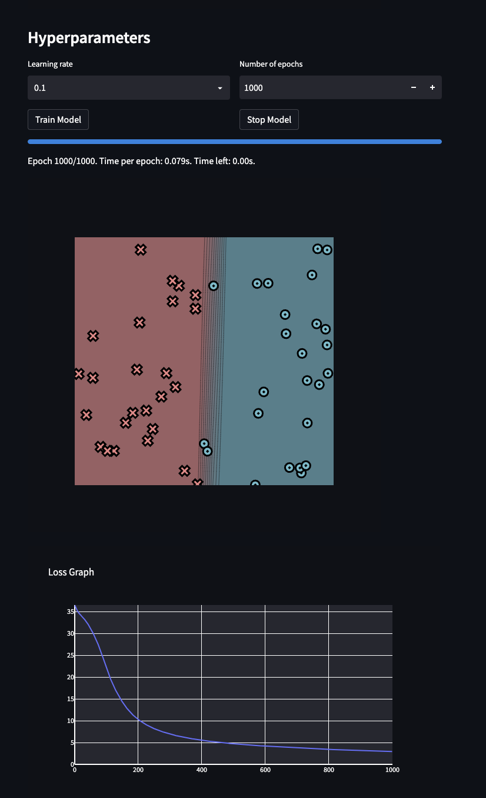
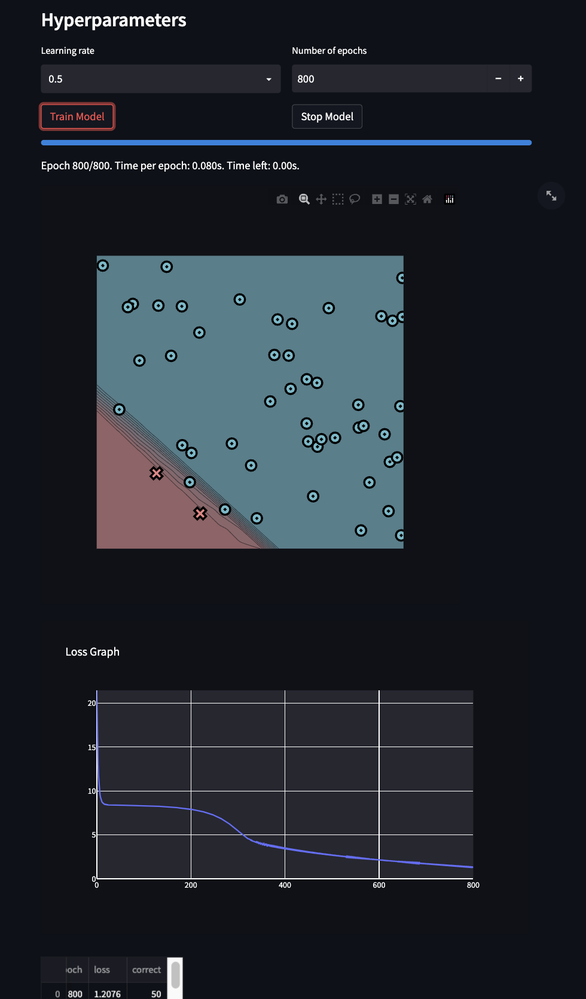
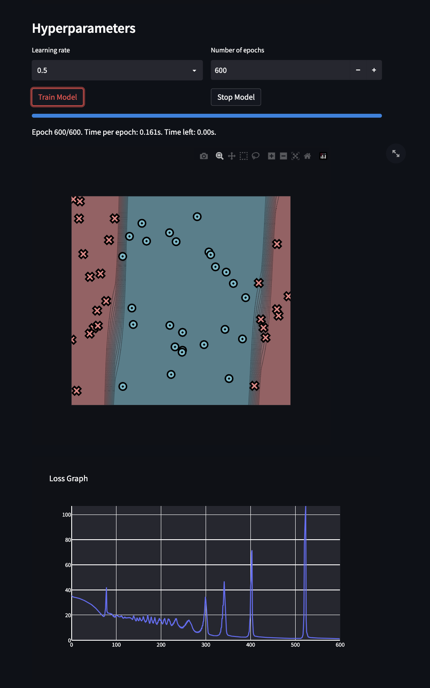
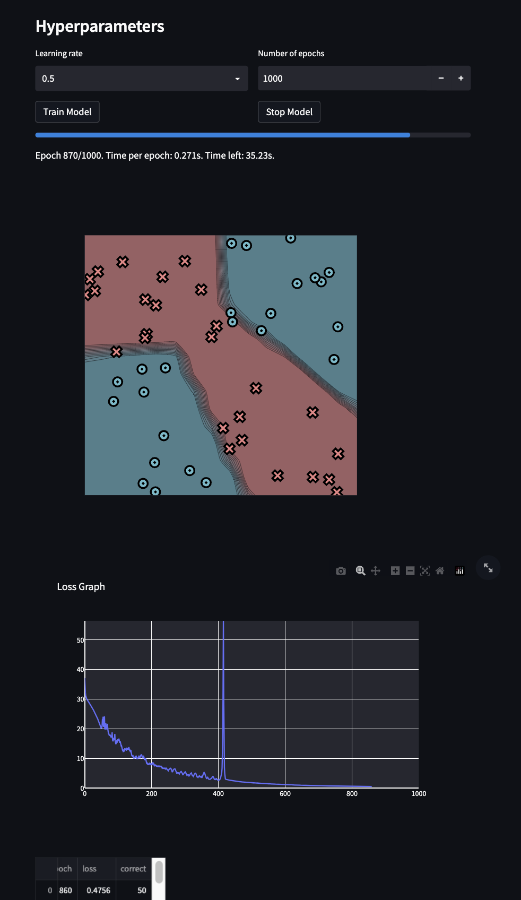

[](https://classroom.github.com/a/YFgwt0yY)
# MiniTorch Module 2


* Docs: https://minitorch.github.io/

* Overview: https://minitorch.github.io/module2/module2/

This assignment requires the following files from the previous assignments. You can get these by running

```bash
python sync_previous_module.py previous-module-dir current-module-dir
```

The files that will be synced are:

        minitorch/operators.py minitorch/module.py minitorch/autodiff.py minitorch/scalar.py minitorch/scalar_functions.py minitorch/module.py project/run_manual.py project/run_scalar.py project/datasets.py


Simple Dataset (Size of hidden layer: 2)


```
Epoch: 10/1000, loss: 35.08116298263846, correct: 25
Epoch: 20/1000, loss: 34.1575391773384, correct: 25
Epoch: 30/1000, loss: 33.37452158542817, correct: 25
Epoch: 40/1000, loss: 32.436317396294726, correct: 25
Epoch: 50/1000, loss: 31.260799130663248, correct: 36
Epoch: 60/1000, loss: 29.878549452321522, correct: 41
Epoch: 70/1000, loss: 28.3017670125176, correct: 41
Epoch: 80/1000, loss: 26.489222346066637, correct: 44
Epoch: 90/1000, loss: 24.45087447169589, correct: 46
Epoch: 100/1000, loss: 22.262284396288862, correct: 47
Epoch: 110/1000, loss: 20.25682348782714, correct: 47
Epoch: 120/1000, loss: 18.49458028986448, correct: 47
Epoch: 130/1000, loss: 16.96291985996395, correct: 47
Epoch: 140/1000, loss: 15.618475516738727, correct: 47
Epoch: 150/1000, loss: 14.41150796673069, correct: 47
Epoch: 160/1000, loss: 13.346058088966672, correct: 47
Epoch: 170/1000, loss: 12.428876845244474, correct: 47
Epoch: 180/1000, loss: 11.62093964758734, correct: 47
Epoch: 190/1000, loss: 10.924651057477202, correct: 48
Epoch: 200/1000, loss: 10.318815630787354, correct: 48
Epoch: 210/1000, loss: 9.79793939436393, correct: 48
Epoch: 220/1000, loss: 9.334317483605048, correct: 48
Epoch: 230/1000, loss: 8.917481825746819, correct: 48
Epoch: 240/1000, loss: 8.545902311035773, correct: 48
Epoch: 250/1000, loss: 8.215933392261293, correct: 48
Epoch: 260/1000, loss: 7.916526345792315, correct: 48
Epoch: 270/1000, loss: 7.64355821900425, correct: 48
Epoch: 280/1000, loss: 7.39395431851794, correct: 48
Epoch: 290/1000, loss: 7.165423601832808, correct: 48
Epoch: 300/1000, loss: 6.956462912601346, correct: 48
Epoch: 310/1000, loss: 6.764706044912668, correct: 49
Epoch: 320/1000, loss: 6.588113713124965, correct: 49
Epoch: 330/1000, loss: 6.424014316570575, correct: 49
Epoch: 340/1000, loss: 6.27129239687195, correct: 49
Epoch: 350/1000, loss: 6.128771740763953, correct: 49
Epoch: 360/1000, loss: 5.995367679158448, correct: 50
Epoch: 370/1000, loss: 5.870209709031831, correct: 50
Epoch: 380/1000, loss: 5.752514083787406, correct: 50
Epoch: 390/1000, loss: 5.641574784824018, correct: 50
Epoch: 400/1000, loss: 5.536771639507916, correct: 50
Epoch: 410/1000, loss: 5.437554927886982, correct: 50
Epoch: 420/1000, loss: 5.343436298786741, correct: 50
Epoch: 430/1000, loss: 5.253980931601673, correct: 50
Epoch: 440/1000, loss: 5.168800771910452, correct: 50
Epoch: 450/1000, loss: 5.087548692193441, correct: 50
Epoch: 460/1000, loss: 5.009913448695256, correct: 50
Epoch: 470/1000, loss: 4.935615322911843, correct: 50
Epoch: 480/1000, loss: 4.864402351371138, correct: 50
Epoch: 490/1000, loss: 4.796047060624611, correct: 50
Epoch: 500/1000, loss: 4.730343635922463, correct: 50
Epoch: 510/1000, loss: 4.66710546210984, correct: 50
Epoch: 520/1000, loss: 4.606162984026594, correct: 50
Epoch: 530/1000, loss: 4.547361841269934, correct: 50
Epoch: 540/1000, loss: 4.49056123872269, correct: 50
Epoch: 550/1000, loss: 4.435632519882374, correct: 50
Epoch: 560/1000, loss: 4.382457914859085, correct: 50
Epoch: 570/1000, loss: 4.330929439044899, correct: 50
Epoch: 580/1000, loss: 4.280947921985385, correct: 50
Epoch: 590/1000, loss: 4.232422148987121, correct: 50
Epoch: 600/1000, loss: 4.185268100547151, correct: 50
Epoch: 610/1000, loss: 4.139408276856304, correct: 50
Epoch: 620/1000, loss: 4.0947710964639645, correct: 50
Epoch: 630/1000, loss: 4.051290359748432, correct: 50
Epoch: 640/1000, loss: 4.008904769155527, correct: 50
Epoch: 650/1000, loss: 3.9675574992866074, correct: 50
Epoch: 660/1000, loss: 3.9271958108662797, correct: 50
Epoch: 670/1000, loss: 3.8877707034269546, correct: 50
Epoch: 680/1000, loss: 3.8492366022340287, correct: 50
Epoch: 690/1000, loss: 3.8115510755616375, correct: 50
Epoch: 700/1000, loss: 3.7746745789292864, correct: 50
Epoch: 710/1000, loss: 3.7385702233392233, correct: 50
Epoch: 720/1000, loss: 3.7032035649228185, correct: 50
Epoch: 730/1000, loss: 3.6685424137215468, correct: 50
Epoch: 740/1000, loss: 3.6345566596025405, correct: 50
Epoch: 750/1000, loss: 3.6012181135454986, correct: 50
Epoch: 760/1000, loss: 3.568500362743912, correct: 50
Epoch: 770/1000, loss: 3.536378638142361, correct: 50
Epoch: 780/1000, loss: 3.5048296931877827, correct: 50
Epoch: 790/1000, loss: 3.4738316927090436, correct: 50
Epoch: 800/1000, loss: 3.443364110958467, correct: 50
Epoch: 810/1000, loss: 3.4134076379539158, correct: 50
Epoch: 820/1000, loss: 3.38394409335185, correct: 50
Epoch: 830/1000, loss: 3.354956347163347, correct: 50
Epoch: 840/1000, loss: 3.3264282466962123, correct: 50
Epoch: 850/1000, loss: 3.29834454916993, correct: 50
Epoch: 860/1000, loss: 3.270690859506049, correct: 50
Epoch: 870/1000, loss: 3.2434535728462803, correct: 50
Epoch: 880/1000, loss: 3.2166198213947625, correct: 50
Epoch: 890/1000, loss: 3.1901774252201, correct: 50
Epoch: 900/1000, loss: 3.1642368211016825, correct: 50
Epoch: 910/1000, loss: 3.1389224430869693, correct: 50
Epoch: 920/1000, loss: 3.1140321838817004, correct: 50
Epoch: 930/1000, loss: 3.0898684428625454, correct: 50
Epoch: 940/1000, loss: 3.066492767894645, correct: 50
Epoch: 950/1000, loss: 3.043764519172148, correct: 50
Epoch: 960/1000, loss: 3.0214557481138966, correct: 50
Epoch: 970/1000, loss: 2.9994590690500744, correct: 50
Epoch: 980/1000, loss: 2.9777501392808325, correct: 50
Epoch: 990/1000, loss: 2.9563126385476304, correct: 50
Epoch: 1000/1000, loss: 2.9351344588286596, correct: 50
```
Diagonal Dataset (Size of hidden layer: 2)


```
Epoch: 10/800, loss: 9.066714119080201, correct: 48
Epoch: 20/800, loss: 8.447385552192303, correct: 48
Epoch: 30/800, loss: 8.396344908053575, correct: 48
Epoch: 40/800, loss: 8.383318648677891, correct: 48
Epoch: 50/800, loss: 8.373545727587947, correct: 48
Epoch: 60/800, loss: 8.363724507627579, correct: 48
Epoch: 70/800, loss: 8.353209740326381, correct: 48
Epoch: 80/800, loss: 8.341581867956876, correct: 48
Epoch: 90/800, loss: 8.328409804762364, correct: 48
Epoch: 100/800, loss: 8.31325002958501, correct: 48
Epoch: 110/800, loss: 8.296151083952902, correct: 48
Epoch: 120/800, loss: 8.276195396955154, correct: 48
Epoch: 130/800, loss: 8.252682047233868, correct: 48
Epoch: 140/800, loss: 8.224788462052338, correct: 48
Epoch: 150/800, loss: 8.191523600386494, correct: 48
Epoch: 160/800, loss: 8.1516864026145, correct: 48
Epoch: 170/800, loss: 8.10542724377388, correct: 48
Epoch: 180/800, loss: 8.052220747645976, correct: 48
Epoch: 190/800, loss: 7.989517425045301, correct: 48
Epoch: 200/800, loss: 7.915038504281708, correct: 48
Epoch: 210/800, loss: 7.825645944875858, correct: 48
Epoch: 220/800, loss: 7.717190422639947, correct: 48
Epoch: 230/800, loss: 7.584863663410875, correct: 48
Epoch: 240/800, loss: 7.424661734637968, correct: 48
Epoch: 250/800, loss: 7.228485109417087, correct: 48
Epoch: 260/800, loss: 6.9876540095019735, correct: 48
Epoch: 270/800, loss: 6.6982483748179416, correct: 48
Epoch: 280/800, loss: 6.350493439425228, correct: 48
Epoch: 290/800, loss: 5.945895438817903, correct: 48
Epoch: 300/800, loss: 5.505068658945489, correct: 48
Epoch: 310/800, loss: 5.056015748464579, correct: 48
Epoch: 320/800, loss: 4.679427233947909, correct: 48
Epoch: 330/800, loss: 4.336348840553413, correct: 48
Epoch: 340/800, loss: 4.139440769152654, correct: 48
Epoch: 350/800, loss: 3.957060355945825, correct: 48
Epoch: 360/800, loss: 3.9411311270531435, correct: 48
Epoch: 370/800, loss: 3.8848373770761593, correct: 48
Epoch: 380/800, loss: 3.7777487249768322, correct: 48
Epoch: 390/800, loss: 3.667746598844375, correct: 48
Epoch: 400/800, loss: 3.563671825663744, correct: 48
Epoch: 410/800, loss: 3.4671290352571686, correct: 48
Epoch: 420/800, loss: 3.3745713003660414, correct: 48
Epoch: 430/800, loss: 3.2869978917395897, correct: 48
Epoch: 440/800, loss: 3.201698422977764, correct: 48
Epoch: 450/800, loss: 3.1211346498059798, correct: 48
Epoch: 460/800, loss: 3.043036531607893, correct: 48
Epoch: 470/800, loss: 2.9667868337623267, correct: 48
Epoch: 480/800, loss: 2.893946356854041, correct: 48
Epoch: 490/800, loss: 2.8231340193894843, correct: 48
Epoch: 500/800, loss: 2.7545053079052124, correct: 48
Epoch: 510/800, loss: 2.6864377108067496, correct: 48
Epoch: 520/800, loss: 2.62134370513249, correct: 48
Epoch: 530/800, loss: 2.5577159720977654, correct: 48
Epoch: 540/800, loss: 2.4945058051538087, correct: 48
Epoch: 550/800, loss: 2.433976559073216, correct: 48
Epoch: 560/800, loss: 2.374835480719023, correct: 48
Epoch: 570/800, loss: 2.317024543508049, correct: 48
Epoch: 580/800, loss: 2.260216104570733, correct: 48
Epoch: 590/800, loss: 2.204681450512696, correct: 48
Epoch: 600/800, loss: 2.1500881250868913, correct: 48
Epoch: 610/800, loss: 2.096408449014873, correct: 48
Epoch: 620/800, loss: 2.0429201902716945, correct: 48
Epoch: 630/800, loss: 1.9903372034124256, correct: 48
Epoch: 640/800, loss: 1.9395896199702842, correct: 48
Epoch: 650/800, loss: 1.88956915092301, correct: 48
Epoch: 660/800, loss: 1.8394161149223442, correct: 48
Epoch: 670/800, loss: 1.7909521074261276, correct: 48
Epoch: 680/800, loss: 1.7431020998852893, correct: 49
Epoch: 690/800, loss: 1.6958239058340938, correct: 49
Epoch: 700/800, loss: 1.649088063661314, correct: 49
Epoch: 710/800, loss: 1.6028664967718556, correct: 49
Epoch: 720/800, loss: 1.5571335499818888, correct: 49
Epoch: 730/800, loss: 1.5118671364733691, correct: 50
Epoch: 740/800, loss: 1.467049990841354, correct: 50
Epoch: 750/800, loss: 1.4226710115042571, correct: 50
Epoch: 760/800, loss: 1.378726657203547, correct: 50
Epoch: 770/800, loss: 1.3352223372220093, correct: 50
Epoch: 780/800, loss: 1.2921737043200423, correct: 50
Epoch: 790/800, loss: 1.2496077263396108, correct: 50
Epoch: 800/800, loss: 1.2075633828583725, correct: 50
```
Split Dataset (Size of hidden layer: 4)


```
Epoch: 10/600, loss: 33.96954130667459, correct: 30
Epoch: 20/600, loss: 33.005730133648115, correct: 28
Epoch: 30/600, loss: 31.497632341291467, correct: 34
Epoch: 40/600, loss: 29.599834250144905, correct: 36
Epoch: 50/600, loss: 27.017022860691846, correct: 37
Epoch: 60/600, loss: 23.60249898671823, correct: 41
Epoch: 70/600, loss: 19.579793166588967, correct: 45
Epoch: 80/600, loss: 23.094588856602066, correct: 34
Epoch: 90/600, loss: 20.635575535043063, correct: 36
Epoch: 100/600, loss: 18.935610658378163, correct: 36
Epoch: 110/600, loss: 18.672534607913157, correct: 36
Epoch: 120/600, loss: 18.36782350176045, correct: 36
Epoch: 130/600, loss: 18.0394369079215, correct: 37
Epoch: 140/600, loss: 19.241834764172346, correct: 36
Epoch: 150/600, loss: 15.750726242856421, correct: 40
Epoch: 160/600, loss: 16.931843769616304, correct: 39
Epoch: 170/600, loss: 17.16855864354329, correct: 39
Epoch: 180/600, loss: 16.81590830145798, correct: 39
Epoch: 190/600, loss: 13.279932194391368, correct: 42
Epoch: 200/600, loss: 15.31690833634562, correct: 40
Epoch: 210/600, loss: 15.313956613726521, correct: 41
Epoch: 220/600, loss: 15.159191697521221, correct: 41
Epoch: 230/600, loss: 13.69073369717035, correct: 41
Epoch: 240/600, loss: 11.671981155215596, correct: 44
Epoch: 250/600, loss: 9.919444972582921, correct: 45
Epoch: 260/600, loss: 14.519639130422055, correct: 42
Epoch: 270/600, loss: 10.934039036561067, correct: 45
Epoch: 280/600, loss: 6.223166040054192, correct: 48
Epoch: 290/600, loss: 7.847357753603781, correct: 47
Epoch: 300/600, loss: 34.549009842152074, correct: 37
Epoch: 310/600, loss: 4.38516584602001, correct: 50
Epoch: 320/600, loss: 3.5643499081796883, correct: 50
Epoch: 330/600, loss: 4.09066393332366, correct: 49
Epoch: 340/600, loss: 27.816359316750688, correct: 36
Epoch: 350/600, loss: 4.052762529616751, correct: 50
Epoch: 360/600, loss: 3.173211297528783, correct: 50
Epoch: 370/600, loss: 2.764272134347798, correct: 50
Epoch: 380/600, loss: 2.484196542458222, correct: 50
Epoch: 390/600, loss: 2.4514965303812657, correct: 50
Epoch: 400/600, loss: 18.652865955541714, correct: 41
Epoch: 410/600, loss: 3.3603557476792654, correct: 50
Epoch: 420/600, loss: 2.683386796467797, correct: 50
Epoch: 430/600, loss: 2.3519663453068635, correct: 50
Epoch: 440/600, loss: 2.112826391815536, correct: 50
Epoch: 450/600, loss: 1.9240314260241616, correct: 50
Epoch: 460/600, loss: 1.7682955021150095, correct: 50
Epoch: 470/600, loss: 1.6366370370856669, correct: 50
Epoch: 480/600, loss: 1.523449683329481, correct: 50
Epoch: 490/600, loss: 1.4255447057556414, correct: 50
Epoch: 500/600, loss: 1.3470165692528504, correct: 50
Epoch: 510/600, loss: 1.3762888931375585, correct: 50
Epoch: 520/600, loss: 20.013390298337207, correct: 43
Epoch: 530/600, loss: 2.5322382036580215, correct: 50
Epoch: 540/600, loss: 1.8997034846953464, correct: 50
Epoch: 550/600, loss: 1.7048008102378962, correct: 50
Epoch: 560/600, loss: 1.5551076488306097, correct: 50
Epoch: 570/600, loss: 1.4335800564433, correct: 50
Epoch: 580/600, loss: 1.3314080864344482, correct: 50
Epoch: 590/600, loss: 1.243819175307607, correct: 50
Epoch: 600/600, loss: 1.167301950365096, correct: 50
```

Xor Dataset (Size of hidden layer: 6)


```
Epoch: 10/1000, loss: 29.41429805315263, correct: 37
Epoch: 20/1000, loss: 27.7031686752371, correct: 36
Epoch: 30/1000, loss: 25.655752368184842, correct: 38
Epoch: 40/1000, loss: 23.250798541499186, correct: 39
Epoch: 50/1000, loss: 20.223068745546787, correct: 45
Epoch: 60/1000, loss: 24.159130727491444, correct: 41
Epoch: 70/1000, loss: 19.897243331606774, correct: 43
Epoch: 80/1000, loss: 17.019682898284266, correct: 44
Epoch: 90/1000, loss: 16.55604190240202, correct: 43
Epoch: 100/1000, loss: 15.79342430051734, correct: 44
Epoch: 110/1000, loss: 14.200603379682722, correct: 44
Epoch: 120/1000, loss: 12.379858534163438, correct: 44
Epoch: 130/1000, loss: 12.923252717994322, correct: 44
Epoch: 140/1000, loss: 11.889291940821813, correct: 44
Epoch: 150/1000, loss: 9.960353566619872, correct: 46
Epoch: 160/1000, loss: 9.753346971695295, correct: 46
Epoch: 170/1000, loss: 10.777161756839424, correct: 44
Epoch: 180/1000, loss: 9.424177895013294, correct: 46
Epoch: 190/1000, loss: 7.827157087483241, correct: 46
Epoch: 200/1000, loss: 7.664573070956438, correct: 46
Epoch: 210/1000, loss: 7.307461104496749, correct: 46
Epoch: 220/1000, loss: 7.0945907814794555, correct: 46
Epoch: 230/1000, loss: 7.166473376219357, correct: 46
Epoch: 240/1000, loss: 6.582856225130015, correct: 46
Epoch: 250/1000, loss: 6.08026523627403, correct: 46
Epoch: 260/1000, loss: 6.391714962504242, correct: 46
Epoch: 270/1000, loss: 6.412101524221941, correct: 47
Epoch: 280/1000, loss: 5.120325447549485, correct: 47
Epoch: 290/1000, loss: 5.54500561334804, correct: 47
Epoch: 300/1000, loss: 5.277113772266668, correct: 47
Epoch: 310/1000, loss: 4.471213842843759, correct: 48
Epoch: 320/1000, loss: 5.053095346764782, correct: 47
Epoch: 330/1000, loss: 4.7613476590809105, correct: 48
Epoch: 340/1000, loss: 3.524617879222296, correct: 49
Epoch: 350/1000, loss: 3.9224850847674766, correct: 48
Epoch: 360/1000, loss: 5.064977358532095, correct: 47
Epoch: 370/1000, loss: 3.1443967498945984, correct: 49
Epoch: 380/1000, loss: 3.111727607020951, correct: 49
Epoch: 390/1000, loss: 2.8486709209079764, correct: 49
Epoch: 400/1000, loss: 2.5918707567393766, correct: 49
Epoch: 410/1000, loss: 4.279704392325918, correct: 47
Epoch: 420/1000, loss: 4.919141797665335, correct: 48
Epoch: 430/1000, loss: 2.7239755339106804, correct: 50
Epoch: 440/1000, loss: 2.5186351528322533, correct: 50
Epoch: 450/1000, loss: 2.2721657973621734, correct: 50
Epoch: 460/1000, loss: 2.1821148911476933, correct: 50
Epoch: 470/1000, loss: 2.078893178389687, correct: 50
Epoch: 480/1000, loss: 1.9747766673882485, correct: 50
Epoch: 490/1000, loss: 1.8603603579621557, correct: 50
Epoch: 500/1000, loss: 1.763396681843021, correct: 50
Epoch: 510/1000, loss: 1.6782421376931393, correct: 50
Epoch: 520/1000, loss: 1.6370481891466089, correct: 50
Epoch: 530/1000, loss: 1.5429583499181083, correct: 50
Epoch: 540/1000, loss: 1.4690086429732938, correct: 50
Epoch: 550/1000, loss: 1.4046727710585858, correct: 50
Epoch: 560/1000, loss: 1.3429092222015147, correct: 50
Epoch: 570/1000, loss: 1.2876014454787215, correct: 50
Epoch: 580/1000, loss: 1.2402913701721527, correct: 50
Epoch: 590/1000, loss: 1.2092945553875771, correct: 50
Epoch: 600/1000, loss: 1.1550101619964217, correct: 50
Epoch: 610/1000, loss: 1.1088733650400742, correct: 50
Epoch: 620/1000, loss: 1.0266502658138075, correct: 50
Epoch: 630/1000, loss: 0.9780644334480725, correct: 50
Epoch: 640/1000, loss: 0.939967068423979, correct: 50
Epoch: 650/1000, loss: 0.9079484294964618, correct: 50
Epoch: 660/1000, loss: 0.8805375181408502, correct: 50
Epoch: 670/1000, loss: 0.8472490959316271, correct: 50
Epoch: 680/1000, loss: 0.813884135149155, correct: 50
Epoch: 690/1000, loss: 0.7883078307146603, correct: 50
Epoch: 700/1000, loss: 0.7665611877240207, correct: 50
Epoch: 710/1000, loss: 0.7371853440338151, correct: 50
Epoch: 720/1000, loss: 0.7099197988087907, correct: 50
Epoch: 730/1000, loss: 0.6969349642677176, correct: 50
Epoch: 740/1000, loss: 0.669633393098868, correct: 50
Epoch: 750/1000, loss: 0.645286752955233, correct: 50
Epoch: 760/1000, loss: 0.626422378697218, correct: 50
Epoch: 770/1000, loss: 0.6089506355172831, correct: 50
Epoch: 780/1000, loss: 0.5886653330980017, correct: 50
Epoch: 790/1000, loss: 0.5761042356678188, correct: 50
Epoch: 800/1000, loss: 0.5556274086647401, correct: 50
Epoch: 810/1000, loss: 0.5407292308315642, correct: 50
Epoch: 820/1000, loss: 0.5265507065263244, correct: 50
Epoch: 830/1000, loss: 0.5104639316441999, correct: 50
Epoch: 840/1000, loss: 0.49879034649826076, correct: 50
Epoch: 850/1000, loss: 0.48419914822471616, correct: 50
Epoch: 860/1000, loss: 0.4756454207956423, correct: 50
Epoch: 870/1000, loss: 0.4598625779539043, correct: 50
Epoch: 880/1000, loss: 0.4517605939130614, correct: 50
Epoch: 890/1000, loss: 0.4373580815952513, correct: 50
Epoch: 900/1000, loss: 0.42940301967725025, correct: 50
Epoch: 910/1000, loss: 0.41659889539097095, correct: 50
Epoch: 920/1000, loss: 0.4079610551503614, correct: 50
Epoch: 930/1000, loss: 0.39843718430815306, correct: 50
Epoch: 940/1000, loss: 0.3892350270961598, correct: 50
Epoch: 950/1000, loss: 0.3813209826487467, correct: 50
Epoch: 960/1000, loss: 0.3725251639637871, correct: 50
Epoch: 970/1000, loss: 0.36416993978515455, correct: 50
Epoch: 980/1000, loss: 0.35614945862298103, correct: 50
Epoch: 990/1000, loss: 0.35011885698921386, correct: 50
Epoch: 1000/1000, loss: 0.34139784281996977, correct: 50
```